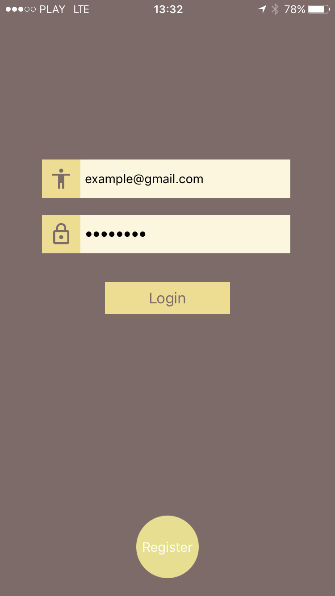

# AppEarance

## Description
AppEarance is an app without a purpose. I am just adding here some code from time to time.

For now it's a very simple application starting with login interface and some input validation, you can navigate to registration view or to photo preview. There is no API for signing in or signing up, so for now you cannot have your own account - I will fix it soon. 

Photos preview is a place where you can search for pictures by tags. I am using pexel's API for that. I didn't commit Authorization key for that, you will have to get it on your own. Here is [pexels page.](https://www.pexels.com/api/)

If you tap on a single photo you will be navigated to single photo preview, where you can see a full image in excelent quality and with zoom options.   

And that's it. Short and simple. However, I got some plans - see the [TODO list](#todo).

## Getting started

#### Required
1. macOS
2. Xcode
3. CocoaPods

### Installation
1. Clone or download this repo on your computer
2. Use terminal to open project directory and run 'pod install'
3. Use .xcworkspace file to open project 

## <a name="todo"> TODO:

Of course there are many things that have to be done. So, for now this is a short list of what I have planned to do:

* Write the rest of the tests and finally start using TDD (Right now there are only tests for coordinator classes).
* Add feature to save photos locally related with a tag. Then you'll be able to find them with a proper tag in your local data base. I will probably use core data for that.
* Make Api for logging in and registration processes.
* Save username and password in a keychain.
* Infinity scroll in collection view
* And finally log out :p

## Screenshots:

 

